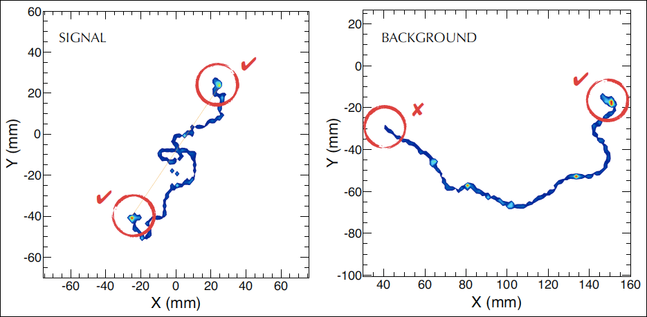

 

# Background: The NEXT Experiment

One of the most important aspects of the NEXT experiment is its ability to reconstruct the ionization tracks produced when energetic electrons deposit their energy in the high pressure xenon gas present inside the NEXT detector.  Because many natural radioactive processes can produce energy depositions with an energy similar to that of neutrinoless double-beta decay (for xenon, this energy is $$ Q_{\beta\beta} \approx 2.4 $$ MeV and common backgrounds include gamma rays produced by nuclear decay of $$^{208}$$Tl and $$^{214}$$Bi.) and because neutrinoless double-beta decay is so rare, we will likely see many events in NEXT with energies that make them look like they could be neutrinoless double-beta decay.  This will occur despite the shielding provided by the many meters of rock in the Pyrenees mountains, the lead castle inside which the detector is placed, and the copper shielding inside the detector surrounding the active region!  These **background** events must be discarded ("rejected") while the real double-beta events - the **signal** events - are kept.  By just looking at the energy deposited by each event, we will be able to remove many events that do not have the energy of interest, but at some point this no longer works because all detectors have a finite energy resolution and we will have to choose a region of energies of potential interest.  Many background events will still fall into this region.

NEXT has further power to reject background because the ionization track of most background events (those due to gamma rays) will be produced by a single electron while the track of a neutrinoless double beta ($$0\nu\beta\beta$$) event is produced by two electrons.  Because of the way energetic electrons lose energy in gaseous detectors, these two types of ionization tracks will, most of the time, look distinctly different.  In particular, energetic electrons ionize xenon atoms at a lower density when they have higher energy, and the ionization density increases as the electron loses energy.  Energetic electrons are also subject to less **multiple scattering** (the phenomenon responsible for causing energetic electrons to undergo sudden sharp changes in direction while depositing their energy) at higher energies than at lower energies.  Thus a single-electron track will look smoother near the beginning with less energy deposited per unit distance, and more distorted near the end, with a "blob" of higher-density energy deposition at the end.  A track produced by two electrons emitted from a common vertex (such as in $$0\nu\beta \beta$$) will be smoother and less dense near the vertex and have two such "blobs" at the ends.

**Monte Carlo simulation** of a signal (left) and background (right) event.  The signal event consists of two electrons emitted from a common vertex with a total energy equal to $$Q_{\beta\beta}$$.  The background event is a single electron with energy $$Q_{\beta\beta}$$.  Figure from [*J. Mart&iacute;n-Albo et al.  Sensitivity of NEXT-100 to neutrinoless double beta decay.  \[JHEP 1605 159 (2016)\]*](https://arxiv.org/abs/1511.09246).
{: style="color:gray; font-size: 80%; text-align: left;"}

The electron track itself is observed in NEXT by a plane of silicon photomultipliers (SiPMs), which convert photons incident on their sensitive area into electrical current.  In the present phase of NEXT, the 10-kg-scale detector NEXT-NEW, the SiPM plane consists of 1792 SiPMs arranged with a 1 cm pitch.  In detecting an event, 2D (x,y) projections of the corresponding ionization track are formed by the light detected in the SiPMs in each z-interval ("slice") of the track.  That is, for each event, we are presented with a series of 2D SiPM "patterns" which must be used to make a decision on which type of event occurred - "signal" or "background".  
